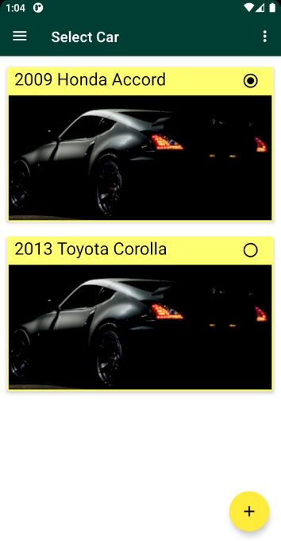
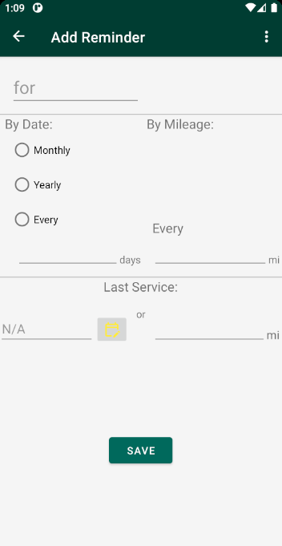

# Car Maintenance Tracker

An app for keeping track of gas fill-ups and services for your vehicles.
Create reminders for regular services with custom intervals based on date/mileage.

## Usage
Add your vehicles on the Car Select screen using the "+" button at the bottom of the screen.

Select your vehicle by clicking on it, and you will be taken to the dashboard page that shows
an overview of your current mileage, recent fill-ups, and reminders.

Selecting the "hamburger" menu at the top-left will open a navigation drawer with top-level destinations,
and clicking the "+" button will bring up choices for adding fill-ups, services, reminders, or editing the
current mileage.

Choosing one of the "Add" buttons will take you to a screen where you can fill out the info
for the specified type, much like the "Add Reminder" screen below.

Selecting "Services Overview" from the navigation drawer will open an overview page
listing your recent services, filtered by type and date range as chosen by the drop-down
menus at the top of the page. At the bottom of the page the total cost of all currently-displayed
services is tallied for the user.

## Credits
Progress Bars by akexorcist
https://github.com/akexorcist/RoundCornerProgressBar

Icons by Google Material Icons
https://fonts.google.com/icons